# Project Overview & Room Configuration
## Home Theater System - Rev 5.2 Extract

**Document Purpose:** Project overview, goals, timeline, and room specifications.

**Source:** Extracted from Home_Theater_System_Complete_Design_Rev5_2.md

---

## Version Control

**Current Version:** 5.2 
**Last Updated:** November 19, 2024

**Version Numbering System:**
- Format: v.Major.Minor
- **Major revision**: Significant design changes, major component changes, substantial rewrites
- **Minor revision**: Small edits, clarifications, corrections (<10 lines of changes)
- Examples: 
 - v3.0 ×  v4.0 (subwoofer dimension optimization)
 - v4.0 ×  v4.1 (typo fixes, minor clarifications)

**Revision History:**
- **v5.2** (Nov 19, 2024): Added detailed LCR isolation specifications - Sorbothane 50 durometer hemispheres (1.5" diameter × 0.5" thick), 4 pucks per speaker, complete installation methodology and best practices, cost $72-96 total
- **v5.1** (Nov 19, 2024): Documentation clarifications - HPF standardized to 18-20Hz throughout, LCR isolation designated as standard (not optional), builder DIY capabilities documented, rear sub placement clarified (hard against rear wall, floor-level), 3" recessed frame construction methodology explained, equipment rack spatial layout clarified
- **v5.0** (Nov 18, 2024): Upgraded Atmos speakers from DIY Eminence build to DIYSG Volt-10 - provides guaranteed reference capability (107-108 dB at listening positions vs. marginal 104-105 dB), better system integration, verified 98 dB sensitivity
- **v4.2** (Nov 17, 2024): Complete encoding cleanup - fixed 100% of UTF-8 character corruption (243 instances corrected, no design changes)
- **v4.1** (Nov 17, 2024): Added 3" recessed driver mounting with integrated AT fabric covers for all subwoofers - Front: 51"W × 27"H × 24"D, Rear: 30"W × 48"H × 22"D
- **v4.0** (Nov 17, 2024): Optimized subwoofer enclosure dimensions - Front: 45"W × 21"H × 24"D, Rear: 24"W × 42"H × 22"D
- **v3.0** (Nov 2024): Added WinISD Pro verification, updated with verified Dayton specifications
- **v2.0** (Nov 2024): Integrated front stage design with corner sub pockets and deck-mounted equipment rack
- **v1.0** (Nov 2024): Initial comprehensive design documentation

---

## Project Overview

**Project Name:** Reference-Level Home Theater Build 
**Timeline:** Construction planned for 2027 
**Room Dimensions:** 16' 26' (D) ’ 10' (H) 
**System Configuration:** 9.4.6 Dolby Atmos 
**Primary Goal:** THX Reference level (115 dB) at main listening position, with exceptional 20Hz subwoofer performance 
**Budget Allocation:** High-end reference system (~$75K-95K total, $30K projector alone)

**Key Reference Documents:**
- Dayton Audio UMII18-22 Official Specification Sheet: `295-718--dayton-audio-UMII18-22-spec-sheet.pdf`
- All subwoofer calculations based on verified manufacturer data

**Builder Capabilities:**
This design assumes the builder has extensive experience with:
- Acoustic treatment design and installation (all DIY at material cost)
- Electrical work to code (licensed-quality installation, DIY labor)
- Advanced woodworking and construction techniques
- Audio system design and integration

Cost estimates reflect DIY labor on all construction, treatment, and electrical work.

---

## Room Configuration

### Physical Layout

**Room Dimensions:**
- Width: 16 feet
- Depth: 26 feet 
- Height: 10 feet (120 inches)
- Total volume: 4,160 cubic feet

**Acoustic Treatment:**
- Fully acoustically treated throughout
- Materials: DIY construction using OC 703, Roxul Safe'n'Sound, Guilford of Maine fabric
- Focus: Modal control, early reflection management, decay time optimization
- Builder has extensive experience with acoustic treatment design and installation

**HVAC System:**
- Separate house system (not part of theater design documentation)
- Designed to kitchen-grade standards (2× standard CFM for room volume)
- Critical for managing heat load from amplification and maintaining comfort
- Noise control essential for reference theater environment

---

### Diagram 1A: Room Layout (Top-Down View)

**Purpose:** Visual overview of the complete theater layout showing all major components and their positions within the 16' × 26' space.

```mermaid
flowchart TD
    subgraph Room["Theater Room - 16' Width × 26' Depth"]
        subgraph Front["Front Wall Area"]
            Stage["Front Stage Platform<br/>16' × 2.5' × 27 inch tall<br/>Subwoofers below in corners"]
            Screen["170 inch Diagonal Screen<br/>2.35:1 Aspect Ratio<br/>Behind: LCR Speakers"]
        end
        
        subgraph Viewing["Seating Area"]
            Row1["Row 1 Seating<br/>11' Couch<br/>13' from screen<br/>Floor Level"]
            Space1["Open Floor Space<br/>5' between rows"]
            Riser["Riser Platform<br/>16' × 8' × 24 inch tall<br/>18' from screen"]
            Row2["Row 2 Seating<br/>11' Couch<br/>On riser platform"]
        end
        
        subgraph Rear["Rear Wall Area"]
            RearWall["Rear Wall System<br/>Backrest + AT Panels<br/>Rear Subs behind"]
        end
        
        Stage --> Screen
        Screen ---|13 feet| Row1
        Row1 ---|5 feet| Space1
        Space1 --> Riser
        Riser --> Row2
        Row2 ---|2-3 feet| RearWall
    end
    
    style Stage fill:#e1f5ff,stroke:#0066cc,stroke-width:2px
    style Screen fill:#fff3cd,stroke:#996600,stroke-width:2px
    style Row1 fill:#d4edda,stroke:#006600,stroke-width:2px
    style Row2 fill:#d4edda,stroke:#006600,stroke-width:2px
    style Riser fill:#f8d7da,stroke:#cc0000,stroke-width:2px
    style RearWall fill:#e1f5ff,stroke:#0066cc,stroke-width:2px
    style Front fill:#fff,stroke:#666,stroke-width:1px
    style Viewing fill:#fff,stroke:#666,stroke-width:1px
    style Rear fill:#fff,stroke:#666,stroke-width:1px
```

**Key Dimensions:**
- **Total Room:** 16' W × 26' D × 10' H (4,160 cubic feet)
- **Front Stage:** 16' × 2.5' D, 27" tall
- **Row 1 Distance:** 13' from screen (floor level)
- **Riser Position:** 18' from screen
- **Row 2 Distance:** 18' from screen (elevated 24")
- **Rear Wall:** 26' from front (room depth)

---

---

**Document Version:** 1.0 (Extracted from Rev 5.2) 
**Created:** November 22, 2025 
**Source:** Home_Theater_System_Complete_Design_Rev5_2.md 
**Status:** Core system documentation