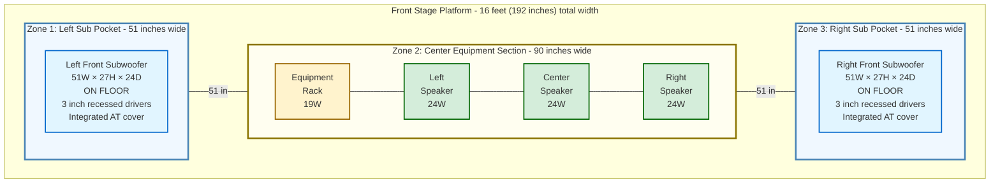
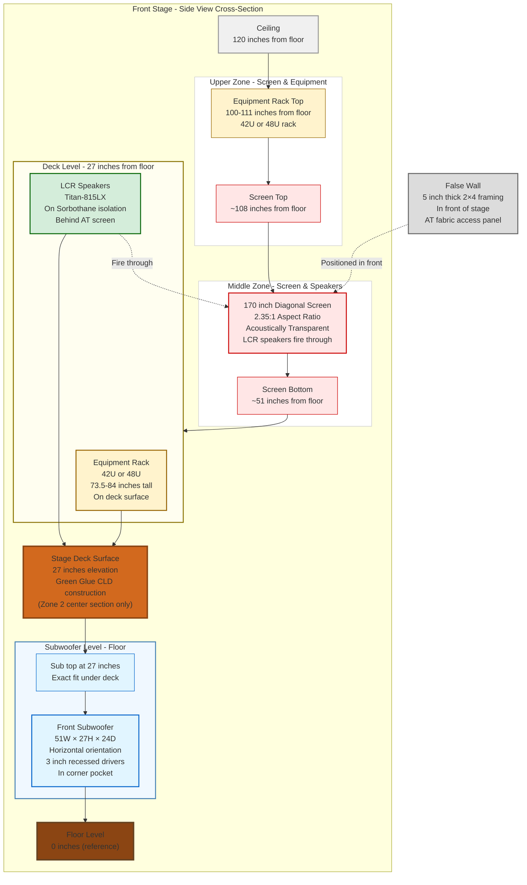

# Front Stage System
## Home Theater System - Rev 5.2 Extract

**Document Purpose:** Complete front stage design including platform, equipment rack, false wall, and screen.

**Source:** Extracted from Home_Theater_System_Complete_Design_Rev5_2.md

---

## Front Stage System

### Stage Platform

**Dimensions:**
- Width: 16 feet (full room width, wall-to-wall)
- Depth: 30 inches (extends from front wall into room)
- Height: 27 inches to deck surface
- Total footprint: 40 square feet

**Construction:** Modified stud wall framing with integrated subwoofer pockets

**Three-zone configuration:**

**Zone 1 - Left Corner Subwoofer Pocket:**
- Width: 51 inches (from left side wall) - accommodates 51"W × 27"H × 24"D subwoofer with integrated AT cover
- Depth: 24-30 inches (front wall to stage front edge)
- Height: 27 inches (floor to deck underside) - exact fit for 27" tall sub with AT cover
- Purpose: Houses left front subwoofer on floor
- Construction: Open cavity (no bottom plate, no studs, no deck in this area)

**Zone 2 - Center Equipment Section:**
- Width: 90 inches (center section between corner pockets: 192" total - 102" corners)
- Depth: 30 inches
- Height: 27 inches to deck surface
- Construction: Solid stud wall framing with Green Glue CLD deck
- Purpose: Supports equipment rack and LCR speakers

**Zone 3 - Right Corner Subwoofer Pocket:**
- Width: 51 inches (from right side wall) - accommodates 51"W × 27"H × 24"D subwoofer with integrated AT cover
- Depth: 24-30 inches (front wall to stage front edge)
- Height: 27 inches (floor to deck underside) - exact fit for 27" tall sub with AT cover
- Purpose: Houses right front subwoofer on floor
- Construction: Open cavity (no bottom plate, no studs, no deck in this area)

---

### Diagram 1B: Front Stage Three-Zone Layout (Top View)

**Purpose:** Clarifies the three-zone stage construction showing subwoofer pocket placement and center equipment section.



**Key Features:**
- **Zone 1 & 3:** Open floor pockets (no deck, no bottom plate) - subs sit directly on floor
- **Zone 2:** Solid stud wall with Green Glue CLD deck - supports rack + LCR
- **Total Width:** 192" (51" + 90" + 51")
- **Subs:** Floor-level for three-wall corner loading
- **Equipment:** All on elevated deck (27" above floor)

---

### Diagram 1C: Front Stage Side View (Cross-Section)

**Purpose:** Shows vertical relationships between floor-level subwoofers, elevated deck, equipment, and screen.



**Critical Elevations:**
- **Floor:** 0" (subwoofers sit here)
- **Stage Deck:** 27" (equipment + LCR here)
- **Screen Bottom:** ~51" from floor (2' from deck)
- **Screen Top:** ~108" from floor (9' from deck)
- **Rack Top:** 100-111" depending on 42U/48U choice
- **Ceiling:** 120" from floor

**Key Insight:** Subwoofers are BELOW the deck, not on it. Equipment and LCR are ON the deck.

---

### Stage Equipment Layout

**On stage deck (27" elevation):**

From left to right across 16-foot width:
1. **Left corner:** Empty above subwoofer pocket
2. **Equipment rack:** 19" wide, floor-standing or wall-mounted, positioned on solid center section
3. **Left speaker:** Titan-815LX (~24" wide)
4. **Center speaker:** Titan-815LX (~24" wide)
5. **Right speaker:** Titan-815LX (~24" wide)
6. **Right corner:** Empty above subwoofer pocket

**Total occupied width:** ~91 inches (rack + three speakers)
**Available width:** 90 inches (center solid section)
**Note:** Equipment spacing will be optimized during installation (tight but functional fit)

### False Wall

**Position:** In front of stage (within 1" of stage front edge)
**Construction:** 2’4 framing + drywall/treatment
**Thickness:** ~5 inches total

**Window opening (for screen):**
- Position: Centered on stage, aligned with LCR speakers
- Width: ~150 inches (slightly smaller than 170" diagonal screen)
- Height: 2' to 9' from stage deck surface (7 feet tall opening)
- Purpose: LCR speakers fire through acoustically transparent screen

**Access panel (left side):**
- Position: Immediately left of screen opening
- Dimensions: 30" wide ’ 84" tall (floor to top of opening)
- Construction: 1’6 frame with Guilford of Maine AT fabric
- Mounting: Mechanical fasteners (cam locks or turn-buttons)
- Purpose: Covers equipment rack, removable for access
- Weight: ~25-30 lbs (one-person removal)

**Solid wall sections:**
- Right of screen: Solid construction (decorative)
- Above/below screen: Solid construction
- Base sections over sub pockets: Open frame for 51"W × 27"H sub openings (subs provide their own integrated AT fabric covers)

### Screen

**Size:** 170 inches diagonal
**Aspect ratio:** 2.35:1 (ultra-wide cinematic)
**Type:** Acoustically transparent fabric
**Mounting:** Attached to false wall (within window opening)
**Position:** LCR speakers directly behind screen

---

### Front Stage Construction Sequence

#### Diagram 3B: Stage Build Process (Step-by-Step)

**Purpose:** Visualizes the 9-step construction sequence for the front stage system, showing dependencies and workflow.

```mermaid
flowchart TD
    Start(["Start: Front Stage Construction"])
    
    Step1["Step 1: Frame Three Zones<br/>Build 2×6 stud walls<br/>Left pocket + Center section + Right pocket<br/>Total width: 192 inches (16 feet)<br/>Height: 27 inches to top plate<br/>Duration: 3 days"]]
    
    Step2["Step 2: Install Green Glue CLD Deck<br/>ONLY on Zone 2 (center section)<br/>Bottom layer: 3/4 inch plywood<br/>Green Glue compound (wavy beads)<br/>Top layer: 3/4 inch plywood<br/>Duration: 2 days (includes cure time)"]]
    
    Parallel["Parallel Workshop Task:<br/>Build Subwoofer Enclosures<br/>Two horizontal front subs<br/>51W × 27H × 24D each<br/>3 inch recessed driver mounting<br/>Integrated AT fabric covers<br/>Duration: 7 days (concurrent)"]
    
    Step3["Step 3: Install Front Subwoofers<br/>Place on floor in corner pockets<br/>Left corner: Three-wall loading<br/>Right corner: Three-wall loading<br/>Exact fit: 27 inch tall subs in 27 inch pockets<br/>Duration: 2 days"]]
    
    Step4["Step 4: Mount Equipment Rack<br/>42U open-frame rack<br/>Position on center deck (Zone 2)<br/>Bolt to deck surface for stability<br/>Against false wall location<br/>Duration: 2 days"]]
    
    Step5["Step 5: Position LCR Speakers<br/>3× Titan-815LX on center deck<br/>Install Sorbothane isolation pucks<br/>4 pucks per speaker (12 total)<br/>Left, Center, Right arrangement<br/>Duration: 1 day"]]
    
    Step6["Step 6: Build False Wall<br/>2×4 framing in front of stage<br/>5 inches thick total<br/>Window opening: 150W × 84H (for screen)<br/>Access panel opening (left side)<br/>Duration: 3 days"]]
    
    Step7["Step 7: Install AT Fabric Panels<br/>Equipment rack access panel (30W × 84H)<br/>1×6 frame + Guilford fabric<br/>Mechanical fasteners (cam locks)<br/>Duration: 2 days"]]
    
    Step8["Step 8: Mount Screen<br/>170 inch diagonal, 2.35:1 aspect<br/>Acoustically transparent fabric<br/>Attach to false wall in window opening<br/>Align with LCR speakers<br/>Duration: 1 day"]]
    
    Complete(["Front Stage Complete<br/>Total Duration: ~21 days<br/>(3 weeks)"])
    
    Start --> Step1
    Step1 --> Step2
    Step1 -.Concurrent.-> Parallel
    Step2 --> Step3
    Parallel --> Step3
    Step3 --> Step4
    Step4 --> Step5
    Step5 --> Step6
    Step6 --> Step7
    Step7 --> Step8
    Step8 --> Complete
    
    style Start fill:#d4edda,stroke:#006600,stroke-width:3px
    style Complete fill:#d4edda,stroke:#006600,stroke-width:3px
    style Step1 fill:#fff3cd,stroke:#996600,stroke-width:2px
    style Step2 fill:#fff3cd,stroke:#996600,stroke-width:2px
    style Step3 fill:#e1f5ff,stroke:#0066cc,stroke-width:2px
    style Step4 fill:#ffe6cc,stroke:#ff9900,stroke-width:2px
    style Step5 fill:#d4edda,stroke:#28a745,stroke-width:2px
    style Step6 fill:#f8d7da,stroke:#dc3545,stroke-width:2px
    style Step7 fill:#e2e3e5,stroke:#6c757d,stroke-width:2px
    style Step8 fill:#cfe2ff,stroke:#0d6efd,stroke-width:2px
    style Parallel fill:#f0f0f0,stroke:#999,stroke-width:2px,stroke-dasharray: 5 5
```

**Construction Notes:**

**Critical Path:**
1. Zone framing must be complete before deck installation
2. Deck must cure (30 min minimum, 30 days full) before heavy equipment
3. Subs must be in place before false wall construction (access)
4. Equipment rack positioned before speakers (space management)
5. False wall built after all stage components in place
6. Screen mounted last (prevents damage during construction)

**Parallel Workflows:**
- Subwoofer enclosures can be built in workshop while framing stage
- Saves ~5 days in total project timeline
- Workshop construction provides better tools, dust control
- Transport completed subs to theater when ready

**Key Checkpoints:**
- ✓ After Step 1: Verify three-zone dimensions (51"+90"+51"=192")
- ✓ After Step 2: Ensure Green Glue applied only to center section
- ✓ After Step 3: Confirm three-wall corner loading for both subs
- ✓ After Step 5: Verify LCR speaker spacing fits in 90" section
- ✓ After Step 6: Check false wall alignment with stage edge
- ✓ After Step 8: Verify LCR speakers fire through screen center

**Total Duration:** ~21 days (3 weeks) with experienced DIY builder

---

### Equipment Rack on Stage

**Rack specifications:**
- Type: 42U or 48U open-frame floor-standing rack
- Width: 19" (standard rack-mount)
- Depth: 24" (standard)
- Height: 73.5" (42U) or 84" (48U)
- Mounting: Bolted to stage deck for stability

**Rack placement:**
- On solid center section of stage deck
- Against false wall back surface (for lateral stability if tall)
- Position: Far left of center section (beside left speaker)

**Access:**
- Remove false wall AT fabric panel (left side of screen)
- Full front access to rack equipment
- Standing access (no bending, no floor panels to open)
- Service while system remains connected


### Diagram 2C: Equipment Rack Layout (42U Vertical Configuration)

**Purpose:** Vertical equipment layout showing all components, their rack unit positions, and ventilation spacing.

```mermaid
flowchart TD
    subgraph Rack["42U Open-Frame Equipment Rack - 73.5 inches tall"]
        direction TB
        
        Top["U42-U23: Ventilation Space<br/>20U available<br/>Natural convection"]
        
        AV10["U22-U20: Marantz AV10<br/>AV Processor<br/>3U height"]
        
        Vent1["U19: Ventilation Space<br/>1U - Passive cooling"]
        
        PURIFI1["U18-U17: PURIFI Monoblock #1<br/>Front Left Sub<br/>1200W @ 2Ω<br/>Fanless"]
        
        Vent2["U16: Ventilation Space<br/>1U - Passive cooling"]
        
        PURIFI2["U15-U14: PURIFI Monoblock #2<br/>Front Right Sub<br/>1200W @ 2Ω<br/>Fanless"]
        
        Vent3["U13: Ventilation Space<br/>1U - Passive cooling"]
        
        PURIFI3["U12-U11: PURIFI Monoblock #3<br/>Rear Left Sub<br/>1200W @ 2Ω<br/>Fanless"]
        
        Vent4["U10: Ventilation Space<br/>1U - Passive cooling"]
        
        PURIFI4["U9-U8: PURIFI Monoblock #4<br/>Rear Right Sub<br/>1200W @ 2Ω<br/>Fanless"]
        
        NcX500["U7-U6: Buckeye NcX500<br/>LCR Amplifier<br/>500W @ 4Ω × 3ch<br/>2U height"]
        
        NC252MP_Surr["U5-U4: Buckeye NC252MP<br/>Surrounds<br/>200W @ 4Ω × 4ch<br/>2U height"]
        
        NC252MP_Atmos["U3-U2: Buckeye NC252MP<br/>Atmos<br/>200W @ 4Ω × 6ch<br/>2U height"]
        
        MiniDSP_Crowson["U1: miniDSP Flex HT<br/>+ NC252MP (Crowsons)<br/>Combined mounting"]
        
        Power["Bottom: Power Distribution<br/>Dedicated 20A circuits<br/>2U height"]
        
        Top --> AV10
        AV10 --> Vent1
        Vent1 --> PURIFI1
        PURIFI1 --> Vent2
        Vent2 --> PURIFI2
        PURIFI2 --> Vent3
        Vent3 --> PURIFI3
        PURIFI3 --> Vent4
        Vent4 --> PURIFI4
        PURIFI4 --> NcX500
        NcX500 --> NC252MP_Surr
        NC252MP_Surr --> NC252MP_Atmos
        NC252MP_Atmos --> MiniDSP_Crowson
        MiniDSP_Crowson --> Power
    end
    
    style AV10 fill:#fff3cd,stroke:#996600,stroke-width:3px
    style PURIFI1 fill:#ffe6cc,stroke:#ff9900,stroke-width:2px
    style PURIFI2 fill:#ffe6cc,stroke:#ff9900,stroke-width:2px
    style PURIFI3 fill:#ffe6cc,stroke:#ff9900,stroke-width:2px
    style PURIFI4 fill:#ffe6cc,stroke:#ff9900,stroke-width:2px
    style NcX500 fill:#d4edda,stroke:#006600,stroke-width:2px
    style NC252MP_Surr fill:#d4edda,stroke:#006600,stroke-width:2px
    style NC252MP_Atmos fill:#d4edda,stroke:#006600,stroke-width:2px
    style MiniDSP_Crowson fill:#e1f5ff,stroke:#0066cc,stroke-width:2px
    style Power fill:#f8d7da,stroke:#cc0000,stroke-width:2px
    style Top fill:#f0f0f0,stroke:#999,stroke-width:1px
    style Vent1 fill:#f0f0f0,stroke:#999,stroke-width:1px,stroke-dasharray: 5 5
    style Vent2 fill:#f0f0f0,stroke:#999,stroke-width:1px,stroke-dasharray: 5 5
    style Vent3 fill:#f0f0f0,stroke:#999,stroke-width:1px,stroke-dasharray: 5 5
    style Vent4 fill:#f0f0f0,stroke:#999,stroke-width:1px,stroke-dasharray: 5 5
```



**Rack Configuration Summary:**

| Rack Units | Equipment | Height | Power | Notes |
|------------|-----------|--------|-------|-------|
| U42-U23 | Ventilation | 20U | - | Expansion space |
| U22-U20 | Marantz AV10 | 3U | ~50W | Processor |
| U19 | Vent Space | 1U | - | Cooling gap |
| U18-U17 | PURIFI #1 | 2U | 1200W | Front L sub |
| U16 | Vent Space | 1U | - | Cooling gap |
| U15-U14 | PURIFI #2 | 2U | 1200W | Front R sub |
| U13 | Vent Space | 1U | - | Cooling gap |
| U12-U11 | PURIFI #3 | 2U | 1200W | Rear L sub |
| U10 | Vent Space | 1U | - | Cooling gap |
| U9-U8 | PURIFI #4 | 2U | 1200W | Rear R sub |
| U7-U6 | NcX500 | 2U | 500W | LCR amp |
| U5-U4 | NC252MP | 2U | 400W | Surrounds |
| U3-U2 | NC252MP | 2U | 600W | Atmos |
| U1 | miniDSP + NC252MP | 1U+ | 500W | Bass + Crowsons |
| Bottom | Power Dist | 2U | - | Distribution |

**Total:** 22U used, 20U available for expansion

**Thermal Management:**
- **Ventilation Strategy:** 1U spacing between PURIFI units for passive cooling
- **Open-Frame Design:** Maximum airflow, no enclosed heat buildup
- **AT Fabric Panel:** Acoustically transparent = air permeable front access
- **Class D Efficiency:** ~95% efficient, minimal heat generation
- **Total Heat Load:** ~250-300W at reference playback levels
- **Fanless Operation:** Silent - critical for reference theater

**Access:**
- Front access through removable AT fabric panel (left of screen)
- Standing access (no floor panels to remove)
- Service while system remains powered and connected
- Panel weight: ~25-30 lbs (one-person removal)

---

### Equipment Rack on Stage Details

**Equipment layout in rack:**
- Marantz AV10 processor: 3U
- PURIFI 1ET9040BA Monoblock #1 (Front L sub): 2U
- PURIFI 1ET9040BA Monoblock #2 (Front R sub): 2U
- PURIFI 1ET9040BA Monoblock #3 (Rear L sub): 2U
- PURIFI 1ET9040BA Monoblock #4 (Rear R sub): 2U
- Buckeye NcX500 (LCR): 2U
- Buckeye NC252MP (surrounds): 2U
- Buckeye NC252MP (Atmos): 2U
- Buckeye NC252MP (Crowsons): 2U
- miniDSP Flex HT: 1U
- Power distribution: 2U
- Total: 22U (20U remaining for ventilation/expansion)

**Ventilation considerations:**
- PURIFI monoblocks are fanless but still generate heat
- Leave 1U spacing between PURIFI units for passive cooling airflow
- AT fabric panel is acoustically transparent (air permeable)
- Open-frame rack design (not enclosed)
- Natural convection cooling adequate for Class D amplifiers
- Total heat load: ~250-300W at reference playback levels

**Ventilation:**
- AT fabric panel is acoustically transparent (air permeable)
- Open-frame rack design (not enclosed)
- Natural convection cooling
- No active fans required (Class D amplifiers run cool)

**Cable management:**
- To LCR speakers: Very short horizontal runs across stage deck
- To surrounds/Atmos: Vertical routing inside false wall structure
- To subwoofers: Through stage structure to floor-level subs
- Power: Dedicated 20A circuits enter from rear or side

---

---

**Document Version:** 1.0 (Extracted from Rev 5.2) 
**Created:** November 22, 2025 
**Source:** Home_Theater_System_Complete_Design_Rev5_2.md (Front Stage System section)