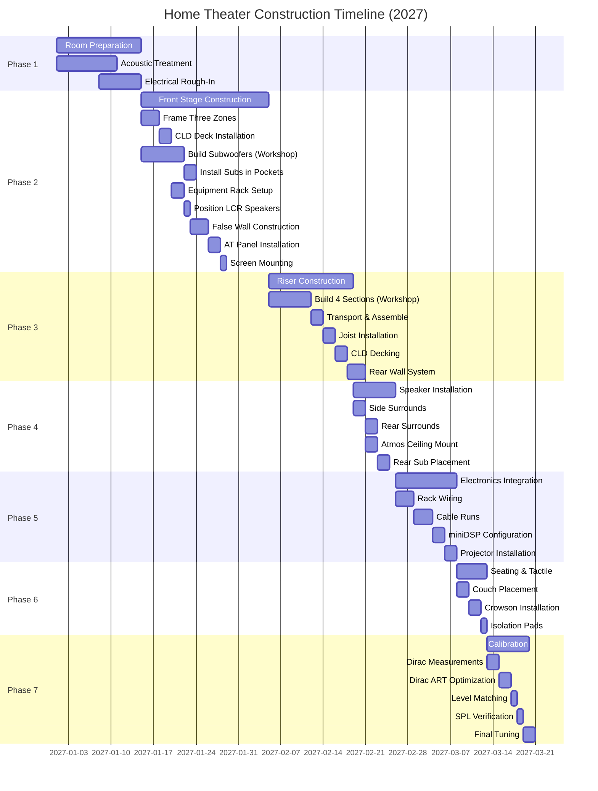

# Construction Timeline & Approach
## Home Theater System - Rev 5.2 Extract

**Document Purpose:** Project timeline, construction sequence, and modular build strategy.

**Source:** Extracted from Home_Theater_System_Complete_Design_Rev5_2.md

---

## Construction Timeline & Approach

### Project Timeline
- Current phase: Design and education (2024-2025)
- Construction: Planned for 2027
- Rationale: Allow time for detailed planning, technology updates, budget accumulation

### Advantages of Timeline
- Technology changes slowly in subwoofer/speaker design (plans remain valid)
- Physics doesn't change (calculations and design decisions remain accurate)
- Pricing visibility when ready to purchase
- No rush mistakes (careful sourcing, wait for sales)
- Can refine room design with actual space in 2027

### Construction Sequence (Anticipated)

#### Diagram 3A: Construction Phase Timeline

**Timeline Summary:**
- **Phase 1 (Room Prep):** 2 weeks
- **Phase 2 (Front Stage):** 3 weeks
- **Phase 3 (Riser):** 2 weeks
- **Phase 4 (Speakers):** 1 week
- **Phase 5 (Electronics):** 1.5 weeks
- **Phase 6 (Seating):** 1 week
- **Phase 7 (Calibration):** 1 week
- **Total Project Duration:** ~12 weeks (3 months)

**Note:** Timeline assumes DIY builder with experience in construction, acoustics, and A/V installation. Commercial installation would likely take 4-6 weeks with dedicated crew.

---

**Phase 1: Room Preparation**
- Acoustic treatment installation
- Electrical rough-in (lighting, outlets, equipment rack)
- Dedicated 20A circuits to front stage area for equipment rack

**Phase 2: Front Stage Construction**
- Build stage with integrated corner subwoofer pockets
- Three-zone construction: left pocket, center solid section, right pocket
- Install Green Glue CLD deck over center section
- Build and install front subwoofer enclosures (horizontal, on floor in pockets)
- Install equipment rack on stage deck (center solid section)
- Install LCR speakers on stage deck
- Build false wall in front of stage
- Install AT fabric panels (front stage sub openings, equipment rack access)
- Screen mounting to false wall

**Phase 3: Riser Construction**
- Build four 8'×4' frame sections (workshop)
- Transport and assemble in theater room
- Install joist system
- Deck with Green Glue CLD
- Build rear wall system (backrest + AT panels)

**Phase 4: Speaker Installation**
- Side surrounds (wall mounting)
- Rear surrounds (above backrest, rear wall)
- Atmos speakers (ceiling mounting)
- Rear subwoofer placement (floor corners behind AT panels)

**Phase 5: Electronics Integration**
- Equipment rack wiring (stage-mounted rack already in place)
- All amplifiers racked and wired
- Signal cable runs (HDMI, balanced audio, speaker wire)
- miniDSP configuration
- Projector installation

**Phase 6: Seating & Tactile**
- Couch placement (both rows)
- Crowson installation in couches
- Sorbothane pads under feet
- Final positioning

**Phase 7: Calibration**
- Professional Dirac Live measurements
- Dirac ART bass optimization
- Level matching
- High-pass filter verification
- SPL testing at MLP
- Fine-tuning and subjective evaluation

---

### Modular Build Strategy

**Stage (Three-zone approach):**
- Center section: Build as solid stud wall platform in workshop or on-site
- Corner pockets: Frame openings during stage construction
- Subwoofer enclosures: Build separately (workshop), install in pockets on-site
- Equipment rack: Assemble and wire on-site
- False wall: Build on-site after stage complete

**Riser (Sectional Approach):**
- Advantage: Build in garage/workshop
- Four 8'×4' sections built separately
- Each section manageable for transport through doorways
- Assemble in room, bolt together
- Deck after assembly (continuous surface, no seams)

**AT Panels (Removable):**
- Build frames separately
- Stretch fabric in controlled environment
- Install mechanical fasteners in theater
- Easy access for future maintenance

**Subwoofer Enclosures:**
- Build all four identically (front horizontal, rear vertical)
- Workshop construction (proper tools, dust control)
- Transport completed cabinets to theater
- Install drivers on-site

---

---

**Document Version:** 1.1 (Added Diagram 3A: Construction Timeline)
**Created:** November 22, 2024
**Updated:** November 23, 2024 (Added Gantt chart)
**Source:** Home_Theater_System_Complete_Design_Rev5_2.md (Construction Timeline section)
