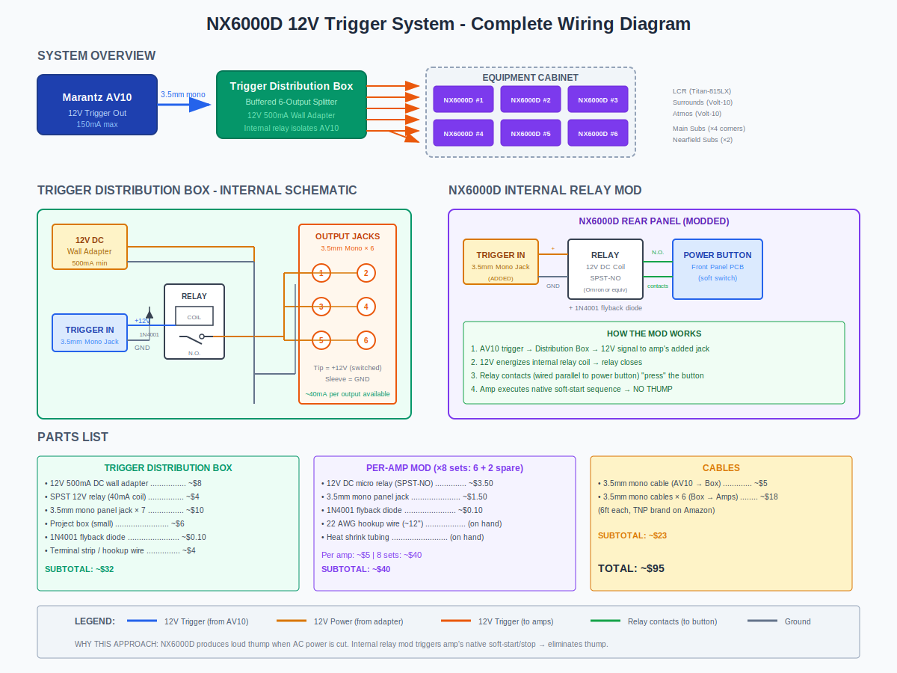
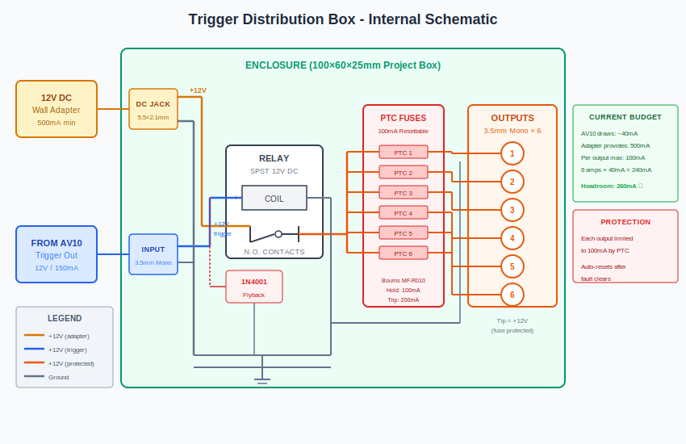
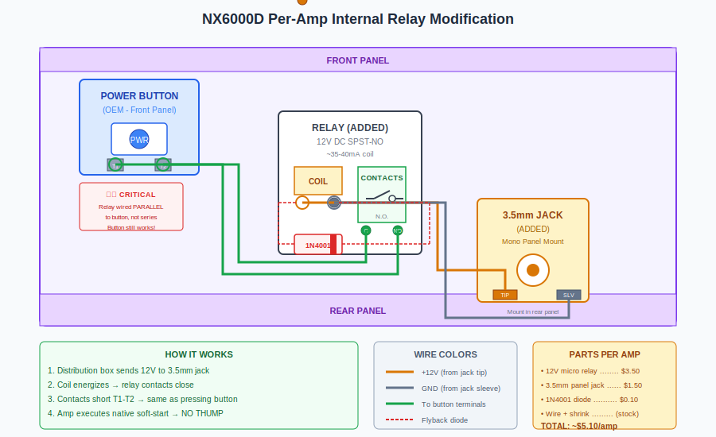

# NX6000D 12V Trigger Power Control System

## Overview

The Behringer NX6000D amplifiers produce an audible thump when AC power is abruptly cut. This occurs because the amp's soft-shutdown sequence is bypassed when mains power is interrupted. The solution is to use the amp's native soft-start/stop circuitry by triggering the front panel power button via an internal relay, controlled by the AV processor's 12V trigger output.

## Problem Statement

| Issue | Impact |
|-------|--------|
| Turn-off thump | Potential speaker damage, unpleasant listening experience |
| 6 amplifiers | Cannot parallel all relays directly from AV10 trigger |
| Marantz AV10 trigger spec | 12V DC / 150mA max per output (×2 outputs) |
| Relay coil draw | ~35-40mA each × 6 amps = 210-240mA total |

**Conclusion:** Direct parallel connection exceeds AV10's 150mA capacity. A buffered trigger distribution box is required.

## System Architecture

**Signal Flow:**
1. Marantz AV10 powers on → 12V trigger output activates
2. Trigger signal (~40mA) energizes relay in distribution box
3. Distribution box relay switches 12V from wall adapter to all 6 outputs
4. Each amp's internal relay receives 12V → closes contacts → "presses" power button
5. Amps execute native soft-start sequence
6. On AV10 shutdown, reverse sequence occurs with soft-shutdown

---

## Trigger Distribution Box

### Purpose

- Isolate AV10 trigger output from cumulative relay load
- Provide 500mA+ current capacity for 6 amp relays
- Single trigger input, 6 buffered outputs
- **Per-output current limiting** via PTC resettable fuses

### Internal Schematic

### How It Works

1. AV10 sends 12V trigger signal (draws only ~40mA for one relay coil)
2. Internal relay energizes, contacts close
3. Wall adapter's 12V is switched through individual PTC fuses to each output
4. Each amp receives 12V, limited to 100mA max per output
5. When AV10 removes trigger, relay opens, all amps receive power-off signal

### Output Protection

Each output is protected by a PTC (Positive Temperature Coefficient) resettable fuse:

| Parameter | Value |
|-----------|-------|
| Hold current | 100mA |
| Trip current | 200mA |
| Behavior | Self-resetting after fault clears |
| Part | Bourns MF-R010 or equivalent |

**Why PTC fuses?**
- Limits current to each output independently
- Protects against cable shorts or miswired connections
- Auto-resets when fault is removed—no replacement needed
- Cheap insurance (~$0.30 each)

### Current Budget

| Source | Current |
|--------|---------|
| AV10 trigger output capacity | 150mA max |
| Distribution box relay coil | ~40mA |
| **AV10 headroom** | **110mA** ✓ |
| | |
| Wall adapter capacity | 500mA |
| 6 amp relays @ 40mA each | 240mA |
| Per-output PTC limit | 100mA |
| **Adapter headroom** | **260mA** ✓ |

### Parts List - Distribution Box

| Component | Qty | Source | Part Number | Price |
|-----------|-----|--------|-------------|-------|
| 12V 500mA DC wall adapter | 1 | Amazon | Generic 5.5×2.1mm | ~$8 |
| SPST 12V relay (40mA coil, 1A contacts) | 1 | Amazon | Generic micro relay | ~$4 |
| PTC resettable fuse (100mA) | 6 | DigiKey/Mouser | Bourns MF-R010 | ~$2 |
| 3.5mm mono panel jack | 7 | Parts Express | 090-296 | ~$10.50 |
| Project box | 1 | Amazon | 100×60×25mm ABS | ~$6 |
| 1N4001 flyback diode | 1 | On-hand / DigiKey | 1N4001 | ~$0.10 |
| Terminal strip (6-pos) | 1 | Amazon | Barrier strip | ~$2 |
| 22 AWG hookup wire | — | On-hand | — | — |
| **Subtotal** | | | | **~$34** |

### Construction Notes

1. **Drill panel for jacks** - 1× input, 6× output, 1× DC barrel jack
2. **Mount relay** - Double-sided tape or hot glue
3. **Wire +12V rail** - DC jack center pin → relay N.O. contact
4. **Wire trigger input** - Input jack tip → relay coil (+), sleeve → coil (−)
5. **Install PTC fuses** - Relay COM → PTC → output jack tip (one PTC per output)
6. **Wire ground** - GND → all output jack sleeves (parallel)
7. **Install flyback diode** - Across coil terminals, cathode (band) toward (+)

---

## Per-Amp Internal Modification

### Purpose

Add a 3.5mm trigger input jack that controls an internal relay wired in parallel with the front panel power button. When 12V is applied, the relay "presses" the power button, initiating the amp's native soft-start sequence. When 12V is removed, the relay releases, and the amp executes its native soft-shutdown—no thump.

### Wiring Schematic

### Key Points

- **Relay contacts wire in PARALLEL with power button** - both button and relay can trigger power
- **Original button remains functional** - manual override always available
- **Flyback diode mandatory** - protects against voltage spike when coil de-energizes

### Installation Steps

1. **Disconnect AC power** and wait 5 minutes for capacitors to discharge
2. **Remove top cover** (screws on sides and rear)
3. **Locate power button PCB** - trace wires from front panel button
4. **Identify button contacts** - use multimeter in continuity mode; button press should show continuity
5. **Mount 3.5mm jack** - drill hole in rear panel (typically near IEC inlet)
6. **Mount relay** - use double-sided tape or small bracket inside chassis
7. **Wire relay coil:**
   - Tip (center) of 3.5mm jack → Relay coil positive
   - Sleeve of 3.5mm jack → Relay coil negative
   - 1N4001 diode across coil (cathode band toward positive)
8. **Wire relay contacts:**
   - Relay N.O. contact → Power button terminal 1
   - Relay COM contact → Power button terminal 2
9. **Test before reassembly:**
   - Apply 12V to jack with bench supply
   - Verify relay clicks and amp powers on
   - Remove 12V, verify amp powers off gracefully
10. **Reassemble** and label the new jack

### Parts List - Per Amp (×8 sets: 6 primary + 2 spare)

| Component | Qty/Amp | Source | Part Number | Price/Unit |
|-----------|---------|--------|-------------|------------|
| 12V DC micro relay (SPST-NO) | 1 | Amazon | B0057J0B9E | ~$3.50 |
| 3.5mm mono panel jack | 1 | Parts Express | 090-296 | ~$1.50 |
| 1N4001 flyback diode | 1 | On-hand / DigiKey | 1N4001 | ~$0.10 |
| 22 AWG hookup wire | ~12" | On-hand | — | — |
| Heat shrink tubing | Assorted | On-hand | — | — |
| **Per-amp total** | | | | **~$5.10** |
| **8 sets total** | | | | **~$41** |

### Alternative Relay Options

| Relay | Source | Price | Notes |
|-------|--------|-------|-------|
| Amazon 12V micro relay | Amazon | ~$3.50 | Budget choice, adequate |
| Omron G7L-2A-TUB-CB-DC12 | DigiKey | ~$13.74 | Industrial grade, overkill |
| ELK-912 relay module | Amazon | ~$8 | Pre-wired, larger footprint |

---

## Cables

| Cable | Qty | Length | Source | Price |
|-------|-----|--------|--------|-------|
| 3.5mm mono (AV10 → Box) | 1 | 3-6 ft | Amazon (TNP) | ~$5 |
| 3.5mm mono (Box → Amps) | 6 | 6 ft each | Amazon (TNP) | ~$18 |
| **Subtotal** | | | | **~$23** |

**Important:** Use MONO (TS) cables, not stereo (TRS). Mono has 2 conductors (tip + sleeve), stereo has 3 (tip + ring + sleeve).

---

## Complete Bill of Materials

| Category | Items | Subtotal |
|----------|-------|----------|
| Trigger Distribution Box | Wall adapter, relay, PTC fuses ×6, jacks, box, diode, terminals | ~$34 |
| Amp Mods (×8 sets) | Relays, jacks, diodes | ~$41 |
| Cables | 7× 3.5mm mono cables | ~$23 |
| **TOTAL** | | **~$98** |

---

## Sourcing Links

### Distribution Box Components
- 12V Wall Adapter: Amazon search "12V 500mA DC adapter 5.5mm"
- SPST Relay: https://www.amazon.com/12-VDC-SPDT-Micro-Relay/dp/B0057J0B9E
- PTC Fuse (100mA): https://www.digikey.com/en/products/detail/bourns-inc/MF-R010/259904
- 3.5mm Mono Jack: https://www.parts-express.com/3.5mm-Mono-Chassis-Jack-090-296
- Project Box: Amazon search "ABS project box 100x60x25mm"

### Amp Mod Components
- Micro Relay (same as above): https://www.amazon.com/12-VDC-SPDT-Micro-Relay/dp/B0057J0B9E
- Omron (premium option): https://www.digikey.com/en/products/detail/omron-electronics-inc-emc-div/G7L-2A-TUB-CB-DC12/369385

### Cables
- TNP 3.5mm Mono: Amazon search "TNP 3.5mm mono cable 6ft"

---

## Testing Procedure

### Distribution Box Test
1. Connect 12V wall adapter
2. Apply 12V from bench supply to trigger input
3. Verify 12V appears on all 6 outputs (use multimeter)
4. **Test protection:** Short one output briefly—PTC should trip, other outputs unaffected
5. Remove short, wait 30 seconds, verify output recovers
6. Remove trigger input
7. Verify 0V on all outputs

### Per-Amp Test (Before Final Installation)
1. Connect amp to AC power (do NOT connect speakers)
2. Apply 12V to trigger jack
3. Verify amp powers on via soft-start (no thump)
4. Remove 12V from trigger jack
5. Verify amp powers off via soft-shutdown (no thump)
6. Repeat 3× to confirm reliability

### System Integration Test
1. Connect distribution box to AV10 Trigger Out 1
2. Connect all 6 amps to distribution box outputs
3. Power on AV10
4. Verify all 6 amps power on sequentially (slight delay OK)
5. Power off AV10
6. Verify all 6 amps power off gracefully

---

## Troubleshooting

| Symptom | Possible Cause | Solution |
|---------|----------------|----------|
| Amp doesn't respond to trigger | Relay wired incorrectly | Check coil polarity, verify N.O. vs N.C. |
| Relay buzzes but amp doesn't turn on | Contacts not reaching button pads | Verify contact wiring to correct button terminals |
| Distribution box outputs weak | Wall adapter undersized | Use 500mA+ adapter |
| One output dead, others work | PTC tripped (short or overload) | Check cable for short, wait for PTC reset |
| Some amps don't trigger | Bad cable or jack | Test continuity, check jack solder joints |
| Amp still thumps on power-off | Relay releasing too fast | Normal—relay should hold until amp completes shutdown; verify trigger stays active until AV10 fully off |

---

## Safety Notes

- Always disconnect AC power before opening amplifier chassis
- Wait minimum 5 minutes for capacitor discharge
- Use appropriate wire gauge (22 AWG minimum for signal wiring)
- Secure all internal wiring away from heat sinks and moving parts
- Flyback diodes are mandatory—relay coils generate voltage spikes when de-energized
- PTC fuses provide output protection but are not a substitute for careful wiring
- Test thoroughly before connecting speakers

---

## Version History

| Rev | Date | Changes |
|-----|------|---------|
| 1.0 | 2024-12-30 | Initial release |
| 1.1 | 2024-12-30 | Added SVG schematics, replaced ASCII diagrams |
| 1.2 | 2024-12-30 | Added PTC resettable fuses for per-output protection |

---

## Related Documents

- [Behringer_NX6000_Reference.md](Behringer_NX6000_Reference.md) - Amplifier specifications and DSP limitations
- [NX6000_12V_Trigger_System.svg](NX6000_12V_Trigger_System.svg) - Complete system overview diagram
- [NX6000_Trigger_Distribution_Box_Schematic.svg](NX6000_Trigger_Distribution_Box_Schematic.svg) - Distribution box internal wiring
- [NX6000_Amp_Relay_Mod_Schematic.svg](NX6000_Amp_Relay_Mod_Schematic.svg) - Per-amp modification detail
- [06_Electronics_and_Control.md](06_Electronics_and_Control.md) - System integration context
