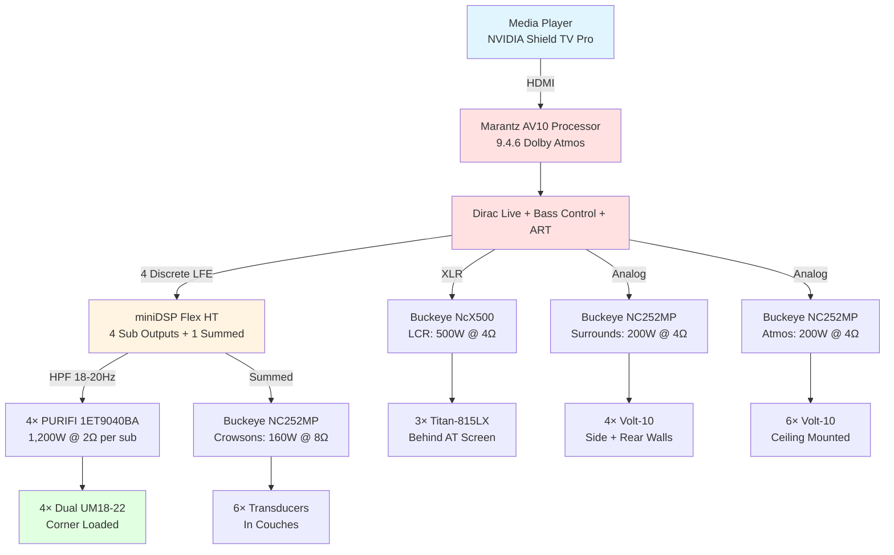
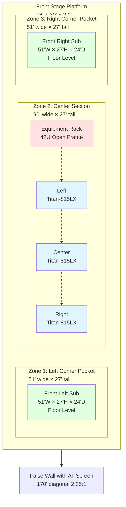
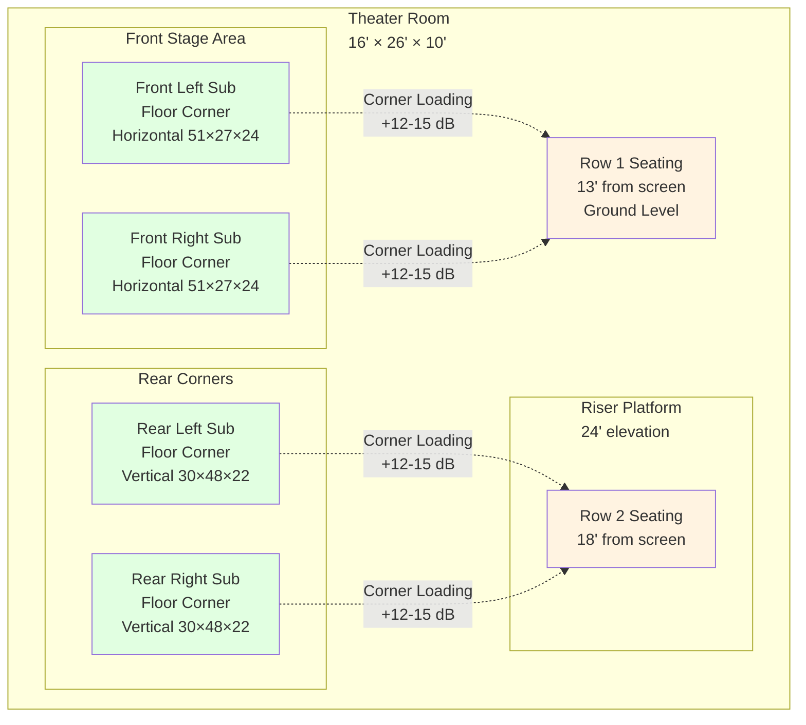

# Mermaid Diagram Implementation Plan
## Home Theater System Documentation Enhancement

**Document Purpose:** Systematic addition of Mermaid diagrams to enhance technical documentation clarity and visual understanding of the reference-level home theater system.

**Target Document:** Home_Theater_System_Complete_Design_Rev5_2.md (and future revisions)

**Date Created:** November 23, 2024

---

## Priority 1: Critical System Diagrams

### 1. Signal Flow Diagram
**Location:** Electronics & Control section  
**Type:** Flowchart  
**Purpose:** Visualize complete audio/video signal path from source to output  
**Status:** ⬜ Not started



---

### 2. Stage Construction Three-Zone Diagram
**Location:** Front Stage System section  
**Type:** Architecture diagram  
**Purpose:** Visualize three-zone stage layout with corner pockets and center section  
**Status:** ⬜ Not started



---

### 3. Four-Corner Subwoofer Placement Diagram
**Location:** Subwoofer System section  
**Type:** Top-down room layout  
**Purpose:** Show precise subwoofer positioning for Dirac ART optimization  
**Status:** ⬜ Not started



---

## Priority 2: Detailed Construction Diagrams

### 4. Equipment Rack Vertical Layout
**Location:** Front Stage System → Equipment Rack section  
**Type:** State diagram showing vertical U-space allocation  
**Status:** ⬜ Not started

### 5. Riser Platform Construction Sequence
**Location:** Seating Configuration → Riser Platform section  
**Type:** Sequence diagram showing build order  
**Status:** ⬜ Not started

### 6. Subwoofer Wiring Diagram
**Location:** Subwoofer System → Wiring Configuration  
**Type:** Circuit diagram showing series/parallel voice coil connections  
**Status:** ✅ **COMPLETE** (November 23, 2024)

---

## Priority 3: Performance Visualization

### 7. SPL Calculation Flowchart
**Location:** Subwoofer System → Performance Calculations  
**Type:** Flowchart showing calculation steps from driver specs to MLP output  
**Status:** ✅ **COMPLETE** (November 23, 2024)

### 8. Room Mode Distribution
**Location:** Technical Appendix → Room Mode Analysis  
**Type:** Graph showing axial modes and frequencies  
**Status:** ✅ **COMPLETE** (November 23, 2024)

---

## Priority 4: System Integration

### 9. Construction Timeline Gantt Chart
**Location:** Construction Timeline & Approach section  
**Type:** Gantt chart showing 7 phases over project duration  
**Status:** ✅ **COMPLETE** (Already exists in 08_Construction_Timeline.md)

### 10. Cost Breakdown Pie Chart
**Location:** Material & Equipment Lists → Grand Total  
**Type:** Pie chart showing budget allocation by category  
**Status:** ✅ **COMPLETE** (November 23, 2024)

---

## Implementation Strategy

### Phase 1: Critical Diagrams (Priority 1)
- Implement diagrams 1-3 immediately
- These provide maximum value for understanding system design
- Estimated time: 2-3 hours

### Phase 2: Construction Details (Priority 2)
- Implement diagrams 4-6 after Phase 1 complete
- Focus on builder-facing documentation
- Estimated time: 2-3 hours

### Phase 3: Technical Visualization (Priority 3)
- Implement diagrams 7-8 for technical appendix
- Educational value for understanding calculations
- Estimated time: 1-2 hours

### Phase 4: Project Management (Priority 4)
- Implement diagrams 9-10 for timeline and budget tracking
- Useful for 2027 build planning
- Estimated time: 1 hour

---

## Mermaid Syntax Reference (Quick Guide)

### Flowchart
```
flowchart TB  (top to bottom)
flowchart LR  (left to right)
Node[Display Text]
Node1 --> Node2  (arrow)
Node1 -.-> Node2  (dotted arrow)
```

### Graph
```
graph TB
subgraph Title
  Node[Text]
end
```

### Styling
```
style NodeName fill:#color
```

---

## Document Update Process

1. **Read current Rev 5.2 document**
2. **Identify insertion points** for each diagram
3. **Generate Mermaid code** for each diagram
4. **Insert diagrams** with appropriate context
5. **Test rendering** in Markdown viewer
6. **Update revision notes** in document header
7. **Increment to Rev 5.3** if substantial additions

---

## Progress Tracking

- [ ] Priority 1: Diagram 1 - Signal Flow
- [ ] Priority 1: Diagram 2 - Stage Construction
- [ ] Priority 1: Diagram 3 - Subwoofer Placement
- [ ] Priority 2: Diagram 4 - Equipment Rack Layout
- [ ] Priority 2: Diagram 5 - Riser Construction Sequence
- [x] Priority 2: Diagram 6 - Subwoofer Wiring ✅
- [x] Priority 3: Diagram 7 - SPL Calculation Flow ✅
- [x] Priority 3: Diagram 8 - Room Modes ✅
- [x] Priority 4: Diagram 9 - Construction Timeline ✅
- [x] Priority 4: Diagram 10 - Cost Breakdown ✅

---

**Next Action:** Begin with Priority 1, Diagram 1 (Signal Flow)

*Plan Version: 1.0*  
*Created: November 23, 2024*  
*Target: Home Theater System Complete Design Documentation*
